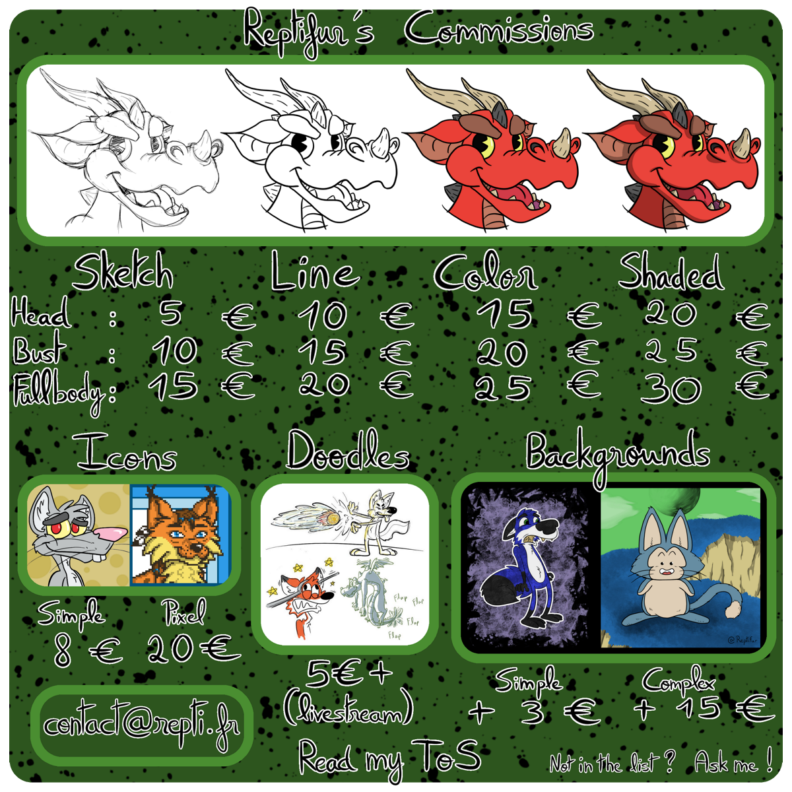

Reptifur’s Terms of Services.
=============================

**By commissioning me, you agree on those ToS.**

Contact
-------

Mail : [contact@repti.fr](mailto:contact@repti.fr)

Everything related to commission work must be done via mail. Be sure to check your mailbox often.

General Disclaimer
------------------

I, the artist, reserve the right to refuse, reject, or cancel your commission at any stage.
If this does happen, you will receive a refund considering what work have been done so far.
I reserve myself the right to use your commission in any way I want, as his creator.
This means for example selling prints, using it as a design for goodies, upload the commission in my galleries, use it for my portfolio, etc. 

Payment
-------

Payment is due when we agree on a sketch (or rough sketch for sketch commissions).
Payments are in EUROS. Payments can be done via Paypal, I’ll send you an invoice. Cash is also accepted if you spot me IRL.

Work in progress
----------------

I’ll provide you WIP(s) during the commission process (I might not provide wips for sketch or colored sketch commissions).

* Step 1: rough sketches to agree on a pose & composition
* Step 2: detailled sketch

About step 1: When we agree on a pose & composition during step 1, you can’t change it afterward.
You’re however encouraged to tell me what you would like me to change so I can correct it for step 2.
I usually give you 2 rough poses to let you chose.

About step 2: During step 2, You’re encouraged as well to ask for corrections so the sketch fits your liking.
I reserve myself the right to refuse to make corrections, or ask for additional money if I feel the need to.
This may happen if you keep making me changing the sketch several times in a row.
When you agree on a sketch, I’ll begin the lineart ( or the painting ), and you won’t be able to ask for corrections.

Completed commission
--------------------

You’ll be given the HD file of your commission when it’s completed as well as a resized file to be displayed on the internet if you want to. 

Maximum file resolution estimation:

* Icon: 500x500 pixels - web/distributable version (feel free to ask me for smaller versions for your favorite websites)
* Sketch/Line/Color/Shaded largest height or width:
    * web/distributable version: 1280 pixels 
    * HD version: 3000 pixels

Exact size may vary.

You can ask me for an alternate version of your commission tho, for example only the character, black and white, only the lineart, .jpg or .png file, etc.
I’ll happily provide you with those!

Refunds
-------

Refunds are to be discussed on a case by case basis.
If, for any reason, you’re willing to cancel a commission, you’ll be refunded considering the work which has already been done.
Completed commissions will not be refunded.

Rights and permissions
----------------------

**The copyright of the final image will stay with me.** 

You’re **NOT** allowed to :

* sell digital copies of your commission
* sell prints of your commission
* repost it without giving me credit
* remove the signature
* repost the HD version of your commission or a higher resolution version than the web/distributable version.
* use your commission for any commercial or lucrative purposes. 
* put your commission on a website like Society6 or Redbubble.

However I might accept to cede some rights for a limited time and limited geographical area for financial counterparts. Please, email me at [contact@repti.fr](mailto:contact@repti.fr).

You’re allowed and even encouraged to repost the commission I’ve done for you, as long as you credit me.

Thank you for reading! If you have any questions regarding those ToS please email me at [contact@repti.fr](mailto:contact@repti.fr).

_Many thanks to Kosse and Nwar for letting me reuse their Tos. :3_
